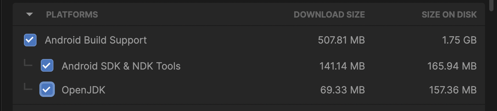
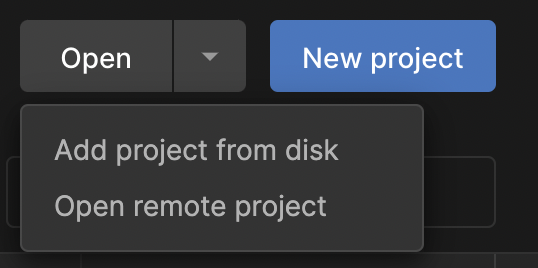
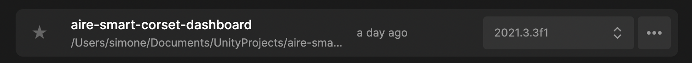
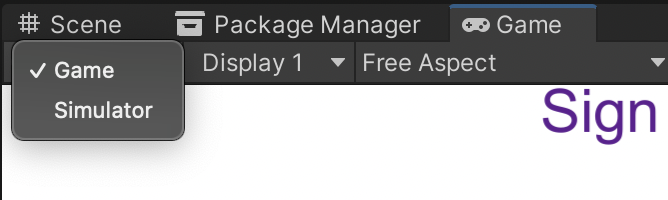
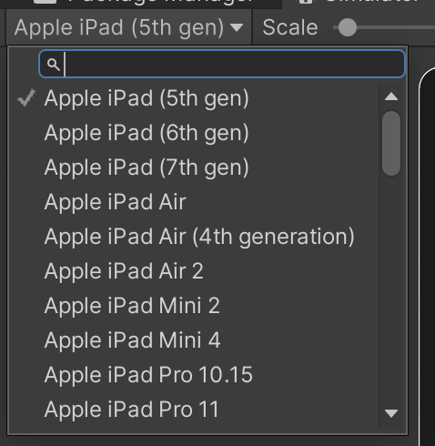
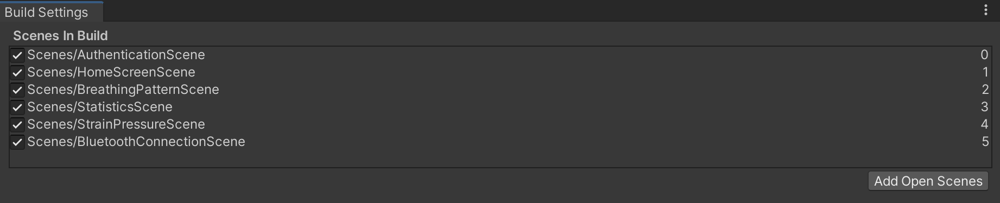

# Health Monitoring Platform for Orthopaedic Devices

## Summary
| Company Name | [East Tallinn Central Hospital](https://www.itk.ee/en) |
| :--- | :--- |
| Development Team Lead Name | [Dr. Tauno Otto](https://www.etis.ee/CV/Tauno_Otto/eng/) |
| Development Team Lead E-mail | [tauno.otto@taltech.ee](mailto:tauno.otto@taltech.ee) |
| Objectives of the Demonstration Project | Develop a machine learning platform for a scoliosis corset and data analytics. |
| Final Report | [Demoproject_report_#1.pdf](https://github.com/ai-robotics-estonia/health_monitoring_platform_for_orthopaedic_devices/files/13800421/Demoproject_report_.1.pdf); [Demonstration-Project_Report_#2.pdf](https://github.com/ai-robotics-estonia/health_monitoring_platform_for_orthopaedic_devices/files/13800420/Demonstration-Project_Report_.2.pdf) |

# Description
## Objectives of the Demonstration Project
*Please describe your project objectives in detail.*

The aim of the demonstration project is to develop a secure health technology platform to connect all orthopaedic devices in the future. The topic is broad and there are many problems to be solved, so it was initially decided to focus on the example of a scoliosis corset. A sensor attached to the corset and a platform for processing data from the sensor have been developed. In collaboration with the doctors at the Ida-Tallinna Central Hospital, an artificial intelligence component will also be implemented on the platform, which could in the future autonomously help patients to heal faster. The platform has been designed from the outset to be general-purpose, for example, it will be possible in the future to develop the ability to use artificial intelligence to predict trauma in the workplace.

- Creating a sensor set that can be attached to scoliosis brace for the brace treatment monitoring.
-	Developing an app for the user for collecting the data about brace wear time, brace pressure and physiotherapy exercises.
-	Creating a machine learning algorithm to analyse brace corrective pressures and give suggestions regarding brace treatment accordingly.

## Activities and Results of the Demonstration Project
### Challenge
*Please describe challenge addressed (i.e, whether and how the initial challenge was changed during the project, for which investment the demonstration project was provided).*

Scoliosis is a spinal deformity and causes excessive sideways curvature of the spine. One of the most common type of scoliosis is adolescent idiopathic scoliosis (AIS). That influences children between 10 to 18 years old and the prevalence is every 4th in 100 people according to Scoliosis Research Society (srs.org).
When the curvature exceeds certain limit (Cobb angle), it needs to be attended with surgery. In order to prevent that, there is a conservative treatment method that uses a spine orthosis (or scoliosis brace) to stop the curvature from progressing, especially during a teen's growth period. Generally, it is recommended to wear the brace 18-23 hours a day and go thorugh physiotherapy during the treatment period. The treatment period can last several years and it is important that the patient is following the prescribed wear times and excercises strictly. There are few challenges related with monitoring the treatment aspects during the treament period:
- As the majority of the patients are children or teenagers, it can be challenging for the doctors and also parents to monitor how long the patient is actually wearing the brace.
- Scoliosis braces are custom-made for the patient according the scoliosis curves and are applying corrective forces on patient’s torso. The pressure cannot be too high because it would be too uncomfortable or even painful for the patient and it cannot be also too low, because then the corset is not fulfilling its purpose. During the treatment it can be challenging to determine the correct pressure (because it is very individual) and when is the right time to replace the corset with new one.
- Most of the physical therapy is done together with a physiotherapist but some of the exercises are done independently. In order to know the full scope of the therapy, it is necessary to monitor what exercises have been done and how they have affected the treatment.

### Data Sources
*Please describe which data was used for the technological solution.*

Technical input(s)/sensor(s) (2-3 sentences)
- Patient centred sensor calibration 
- Validating data against live tests
- Creating a personal normal data range from test data
  
Technical output(s)/action(s) (2-3 sentences)
- Each patient has their own normal data ranges
- Test patient has a personal normal data range.

### Technological Results
*Please describe the results of testing and validating the technological solution.*

See below for the details on the [implementation](#implementation).

### Technical Architecture
*Please describe the technical architecture (e.g, presented graphically, where the technical solution integration with the existing system can also be seen).*

Sensor set with an app would be possible to adjust to any scoliosis brace and monitor the treatment.
-	Monitoring enables to control and optimize the treatment accordingly.
-	Monitoring and analysing the pressures of the scoliosis brace gives an indication when a new scoliosis brace needs to be made and if the existing one is working efficiently.
-	Awareness of the treatment progress and game-like app environment can motivate the patient to follow the prescribed treatment more strictly.

See below for the details on the [implementation](#implementation).

### User Interface 
*Please describe the details about the user interface(i.e, how does the client 'see' the technical result, whether a separate user interface was developed, command line script was developed, was it validated as an experiment, can the results be seen in ERP or are they integrated into work process)*

See below for the details on the [implementation](#implementation).

### Future Potential of the Technical Solution
*Please describe the potential areas for future use of the technical solution.*
Potential sector(s):
- Military defences / body armour
- Industry 5.0 / Operator 4.0 - making human as a part of industrial  digital twin
- e-Health - input to e-Health system regarding parameters

Potential client(s):
- MilRem - robot operator
- CERN - operator of accelerator
- hospitals - ITK, Virumaa, Haapsalu, TÜ Kliinikum
- military cluster - bullet-proof armoury
- Estonian Health Insurance Fund - network of human body parts 3D scanning robots
- Naval institutes and companies - life vests, which display condition of castaway

### Lessons Learned
- AI solution principle  is validated through comparative study based on literature review of pressure sensors related case studies
- AI solution is validated on preselected test points (two type of points - used and unused points in AI model)
- AI enabled uncertainty is evaluated by relocating sensorics across scoliosis brace different locations
- Applicable AI/ML methods analysed, the neural networks (NN) driven approach seems the most appropriate one for given task. External (offline) training is planned to be used, NN-based posture corrective and exercising supportive software will run on microcontroller. 
- The actual AI software development is in starting/piloting phase.

# Implementation

## SMART BRACE UI PROTOTYPE DOCUMENTATION

The aire-smart-corset-dashboard is a user interface prototype aimed at real-time monitoring and guidance of the patients using a smart scoliosis brace. The final purpose of this app is to support both patients and medical personnel during the scoliosis treatment process by providing both real-time data visualization and brace usage statistics.

The interface is in a demo state and constitutes only an interactable mock-up of the future final application.

### Software requirements for testing

- Unity Hub.
- Unity, version 2021.3.3 f1.
- Required Unity modules for Android build.

### INSTALLATION

Before cloning or downloading the repo make sure Unity is installed on your PC. To do so first install Unity Hub available at this [link](https://unity3d.com/get-unity/download). You might need to register first, and activate a free individual, Personal or Student,
license on the Unity website. More info about Unity licenses and usage are available [here](https://store.unity.com/#plans-individual).

After installing Unity Hub, locate the required Unity version (2021.3.3f1.) in the *Install* tab on the left. Alternatively, you can access it at this [page](https://unity3d.com/get-unity/download/archive) and press on the *Unity Hub* button to start the installation.

Before initiating the installation procedure, make sure you flag all the options related to the Android modules installation and include Android Built support with Android SDK & NDK Tools and OpenJDK.

After installation, locate the project you cloned or downloaded on your PC from the Unity Hub *Open, Add project* *from disk* option.

After locating the repo folder on your PC the project will appear in the available projects in Unity Hub. Click on the project name to open it. This might take a few minutes.

### PROJECT SCENES

Unity game engine scenes are assets containing all or parts of the components and elements necessary for a specific application to run. These include interface components, 3D objects, scripts, audio and video sources, input sources, physics components etc. For more basics on the Unity features and UI please refer to the info provided [here](https://unity.com/learn/get-started).

There are a few scenes involved in the current application demo. The first set is constituted by the mobile user interface dashboard pages, including the graphical contents and navigation buttons.

- *AuthenticationScene*
- *BluetoothConnectionScene*
- *BreathingPatternScene*
- *HomeScreenScene*
- *StatisticsScene*
- *StrainPressureScene*

The second includes a 3D 'Digital Twin' visualization of the user avatar and corset, with some preliminary interactions and visualization toggles.

- *Smart Corset DT 0.1*

It is possible to open and access the scenes by navigating the project (*Project* tab in Unity) and open the *Scenes* folder.

### RUNNING ON EDITOR SIMULATOR

To be able to visualize the editor application preview of the Mobile UI:

-   Open *AuthenticationScene*
-   Access the *Game* tab and switch to *Simulator* option

-   Select the device you want to emulate in the drop-down menu

-   Press the play button in the top center of the Unity UI
-   Interact with the UI by using the mouse to click

Follow the same steps to access the 3D corset visualization by opening the dedicated scene *Smart Corset DT 0.1.*

### BUILD

Alternatively, it is possible to build the project in two different apps, install and test them on any android device. To be able to do this:

-   Access the *Build Settings* menu under *File*

-   Open each of the related scenes (mentioned above) and add them to the build by clicking on the *Add Open Scenes* button. Arrange the scenes in the correct order in the menu by clicking and dragging them. Make sure the necessary scenes are flagged so that they can be included in the build.

-   Switch platform to Android build by clicking on the *Android* logo and pressing the *Switch Platform* on the bottom right of the menu.

-   Press *Build* button and wait until the .apk file is saved in the selected location on your PC.

-   Transfer and install the .apk file on your mobile device. You might need to grant permission to install applications from unknown sources on your mobile.

-   Open and test the application

Follow the same steps to build the 3D corset visualization app but include the *Smart Corset DT 0.1* scene only when setting up the build.
